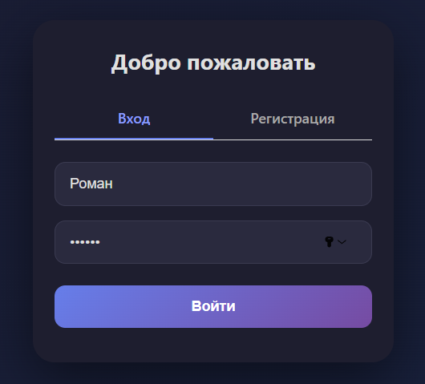
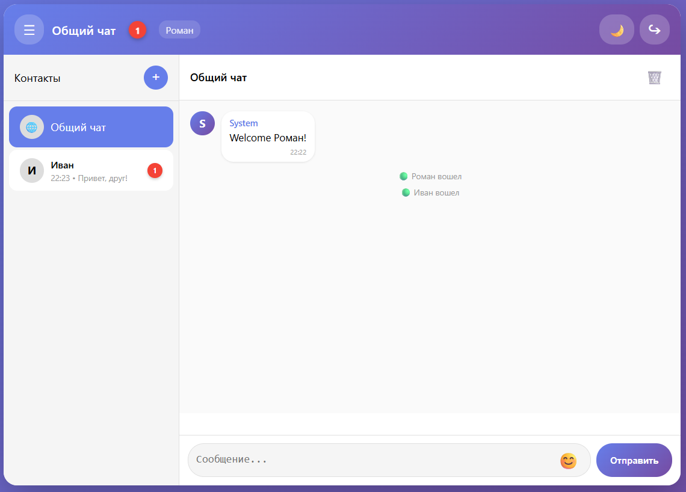
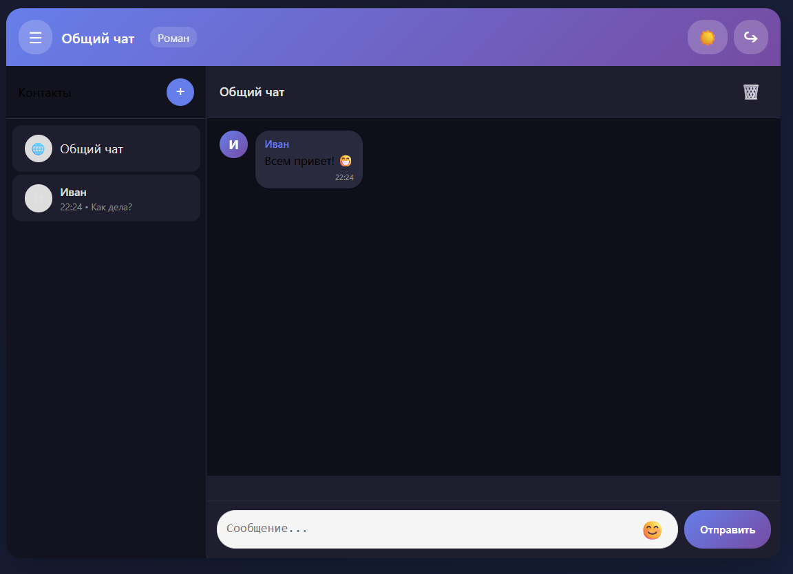

# 💬 Realtime Chat Messenger

Современный веб-мессенджер с поддержкой личных и общих чатов, уведомлениями и отслеживанием непрочитанных сообщений.


### *Протестить на Render.com ([тык](https://realtimechat-qzcc.onrender.com))*

## 📋 Оглавление

- [Возможности](#-возможности)
- [Технологический стек](#-технологический-стек)
- [Установка и запуск](#-установка-и-запуск)
- [Использование](#-использование)
- [Структура проекта](#-структура-проекта)
- [API Endpoints](#-api-endpoints)
- [Хранение данных](#-хранение-данных)
- [Скриншоты интерфейса](#-скриншоты-интерфейса)
- [Устранение проблем](#-устранение-проблем)
- [Лицензия](#-лицензия)

---

## ✨ Возможности

### 🔐 Авторизация и регистрация
- Регистрация новых пользователей с валидацией (имя от 3 символов, пароль от 6)
- Вход по имени пользователя и паролю
- Хеширование паролей с помощью BCrypt
- JWT-токены для аутентификации
- **Требуется вход при каждой загрузке страницы** (сессии не сохраняются для безопасности)

### 💬 Чаты
- **Общий чат** — публичные сообщения для всех пользователей
- **Личные чаты** — приватные сообщения между пользователями
- Автоматическое создание чата при первом сообщении пользователю
- Возможность удаления чата
- Мгновенное переключение между чатами

### 📬 Уведомления и непрочитанные сообщения
- ✅ **Счетчик непрочитанных** на каждом чате в списке
- ✅ **Общий счетчик** в шапке приложения с анимацией пульсации
- Отображение превью последнего сообщения
- Звуковое уведомление при новых сообщениях (когда страница не в фокусе)
- Индикатор набора текста (typing indicator)

### 🎨 Интерфейс
- Адаптивный дизайн для десктопов и мобильных устройств
- Тёмная и светлая темы
- Emoji picker для вставки эмодзи
- Боковая панель с контактами
- Отображение имени текущего пользователя в шапке

### 📱 Мобильная оптимизация
- Поддержка safe-area для устройств с вырезом
- Сворачивающаяся боковая панель на мобильных
- Оптимизированные размеры кнопок для сенсорных экранов

---

## 🛠 Технологический стек

| Компонент | Технология |
|-----------|------------|
| **Backend** | Kotlin 1.9.23 |
| **Фреймворк** | Ktor 2.3.10 |
| **Сервер** | Netty |
| **Аутентификация** | JWT (java-jwt) |
| **Пароли** | BCrypt |
| **Сериализация** | kotlinx.serialization |
| **WebSockets** | Ktor WebSockets |
| **Frontend** | Vanilla JavaScript, HTML5, CSS3 |
| **Хранение** | JSON файлы (data/) |

---

## 🚀 Установка и запуск

### Требования
- Java 17 или выше
- Maven 3.6+

### 1. Клонирование репозитория
```bash
git clone <repository-url>
cd realtime-chat
```

### 2. Сборка проекта
```bash
mvn clean package
```

### 3. Запуск сервера
```bash
java -jar target/realtimeChat-1.0-SNAPSHOT.jar
```

Или через Maven:
```bash
mvn exec:java -Dexec.mainClass="com.shevs.realtimechat.ApplicationKt"
```

### 4. Открытие в браузере
```
http://localhost:8080
```

---

## 📖 Использование

### Регистрация нового пользователя
1. Откройте `http://localhost:8080`
2. Перейдите на вкладку **"Регистрация"**
3. Введите имя пользователя (мин. 3 символа)
4. Введите пароль (мин. 6 символов)
5. Нажмите **"Зарегистрироваться"**

### Вход
1. Введите имя пользователя и пароль
2. Нажмите **"Войти"**
3. После входа вы увидите общий чат и боковую панель контактов

### Отправка сообщений
- **В общий чат**: Просто пишите в текстовом поле и нажмите "Отправить" или Enter
- **В личный чат**: 
  1. Нажмите "+" в панели контактов
  2. Введите имя пользователя
  3. Начните писать сообщение

### Добавление контактов
1. Нажмите кнопку **"+"** в панели контактов
2. Введите имя пользователя
3. Нажмите **"Начать"**
4. Контакт появится в списке

### Переключение тем
Нажмите 🌙/☀️ в правом верхнем углу для переключения между тёмной и светлой темой.

### Выход
Нажмите кнопку **"↪"** в правом верхнем углу.

---

## 📁 Структура проекта

```
realtime-chat/
├── src/main/
│   ├── kotlin/com/shevs/realtimechat/
│   │   ├── Application.kt          # Точка входа
│   │   ├── models/
│   │   │   ├── User.kt             # Модель пользователя
│   │   │   ├── PublicMessage.kt    # Сообщение общего чата
│   │   │   ├── PrivateMessage.kt   # Личное сообщение
│   │   │   ├── Contact.kt          # Контакт
│   │   │   └── Events.kt           # События (UserEvent, TypingEvent)
│   │   ├── plugins/
│   │   │   ├── Routing.kt          # Маршруты и WebSocket
│   │   │   ├── Security.kt         # JWT аутентификация
│   │   │   ├── Serialization.kt    # JSON сериализация
│   │   │   └── Sockets.kt          # Настройка WebSocket
│   │   └── data/
│   │       └── DataStore.kt        # Работа с файлами данных
│   └── resources/
│       ├── static/
│       │   └── index.html          # Frontend приложение
│       └── logback.xml             # Конфигурация логгера
├── data/                           # Файлы данных (создаётся автоматически)
│   ├── users.json
│   ├── contacts.json
│   ├── public_messages.json
│   └── private_messages/
├── pom.xml                         # Maven конфигурация
└── README.md                       # Эта документация
```

---

## 🌐 API Endpoints

### Аутентификация

| Метод | Endpoint | Описание |
|-------|----------|----------|
| `POST` | `/api/register` | Регистрация пользователя |
| `POST` | `/api/login` | Вход, получение JWT токена |

### Контакты (требуется авторизация)

| Метод | Endpoint | Описание |
|-------|----------|----------|
| `GET` | `/api/contacts` | Получить список контактов |
| `POST` | `/api/contacts` | Добавить контакт |

### Сообщения (требуется авторизация)

| Метод | Endpoint | Описание |
|-------|----------|----------|
| `GET` | `/api/messages/public` | Получить историю общего чата |
| `DELETE` | `/api/messages/public` | Очистить историю общего чата |
| `GET` | `/api/messages/private/{username}` | Получить историю переписки |
| `DELETE` | `/api/messages/private/{username}` | Очистить историю переписки |

### WebSocket

| Endpoint | Описание |
|----------|----------|
| `WS` | `/ws?token={jwt_token}` | Подключение к WebSocket для realtime общения |

#### Форматы WebSocket сообщений

**Публичное сообщение:**
```json
{
  "username": "Иван",
  "text": "Привет всем!",
  "timestamp": 1234567890
}
```

**Личное сообщение:**
```json
{
  "from": "Иван",
  "to": "Роман",
  "text": "Привет!",
  "timestamp": 1234567890
}
```

**Событие набора текста:**
```json
{
  "username": "Иван",
  "isTyping": true,
  "to": "Роман"
}
```

**Подтверждение отправки:**
```json
{
  "type": "private_confirm",
  "id": "uuid",
  "timestamp": 1234567890
}
```

---

## 💾 Хранение данных

Данные хранятся в JSON файлах в папке `data/`:

| Файл | Описание |
|------|----------|
| `users.json` | Пользователи с хешированными паролями |
| `contacts.json` | Связи пользователей с контактами |
| `public_messages.json` | История общего чата (до 1000 сообщений) |
| `private_messages/{user1}_{user2}.json` | История переписки (до 500 сообщений на пару) |

**Пример users.json:**
```json
[
  {
    "id": "uuid",
    "username": "Иван",
    "passwordHash": "$2a$10$...",
    "createdAt": 1234567890
  }
]
```

---

## 📱 Скриншоты интерфейса

### Экран входа


### Основной интерфейс



---

## 🔧 Устранение проблем

### Проблема: Сообщения не отображаются
**Решение**: Очистите кэш браузера (Ctrl+Shift+R) и перезапустите сервер.

### Проблема: Не работает WebSocket
**Решение**: Проверьте, что порт 8080 не занят и firewall не блокирует соединение.

### Проблема: Некорректная кодировка (кракозябры)
**Решение**: Удалите файл `data/users.json` и зарегистрируйтесь заново. Сервер использует UTF-8.

### Проблема: Счётчики не обновляются
**Решение**: Обновите страницу. Убедитесь, что JavaScript включён в браузере.

### Проблема: Звук уведомления не работает
**Решение**: Браузеры требуют взаимодействия со страницей для воспроизведения звука. Кликните по странице хотя бы один раз.

### Ошибка при остановке сервера
**Нормальное поведение**: В логах могут появляться `CancellationException` — это корректная обработка закрытия WebSocket соединений.

---

## 📝 Особенности реализации

### Безопасность
- Пароли хешируются с BCrypt (salt rounds = 10)
- JWT токены с временем жизни 24 часа
- Валидация входящих данных
- Защита от XSS через `escapeHtml()`

### Производительность
- WebSocket соединения в памяти (ConcurrentHashMap)
- Ограничение истории сообщений
- Ленивая загрузка истории чатов

### UX решения
- Оптимистичное отображение своих сообщений
- Автоматическое открытие чата при входящем сообщении
- Сброс непрочитанных при открытии чата
- Анимация пульсации на новых уведомлениях

---

## 📄 Лицензия

Этот проект создан в образовательных целях.

---

## 👥 Авторы

- **Роман Шевцов** — Основная разработка

---

**Happy Chatting! 💬**
